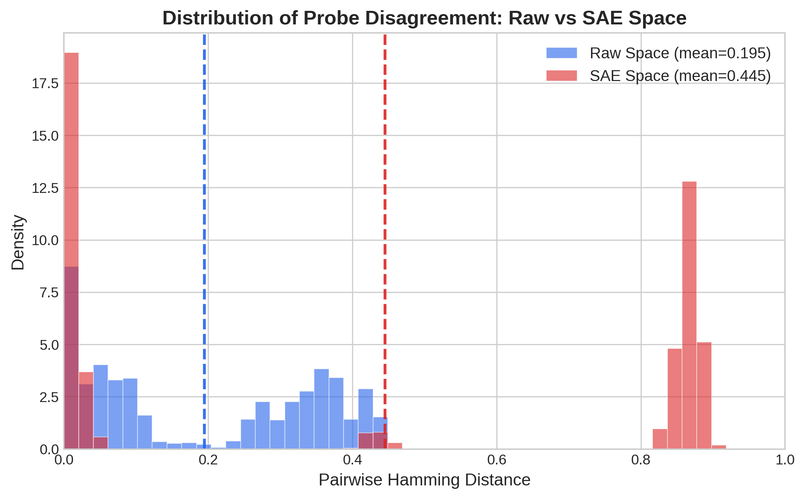
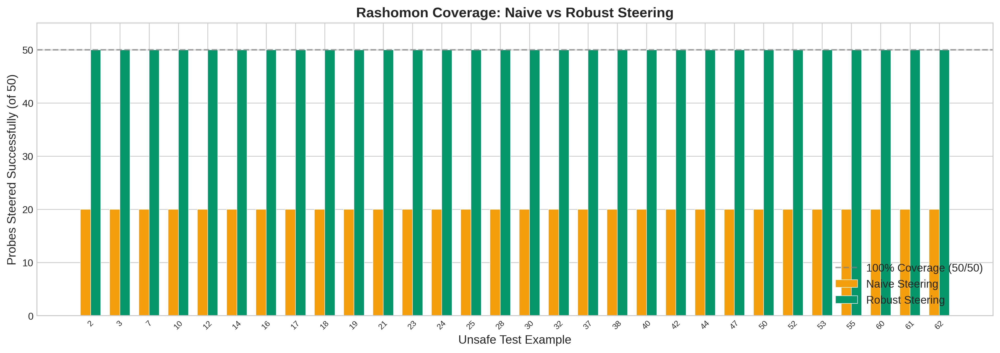

# Rashomon-Robust Representation Steering

**Safety probes with >99.9% cosine similarity disagree on up to 90% of predictions. We derive a closed-form fix.**

[](https://www.python.org/downloads/)
[](https://pytorch.org/)
[](LICENSE)
[](https://huggingface.co/google/gemma-2-2b)

---

## Key Results

| | |
|:---|:---|
| **Rashomon Effect** | 19.5% mean prediction disagreement (raw), **44.5%** (SAE) among probes with equivalent loss |
| **Robust Steering** | **100% Rashomon coverage** vs 40% naive, at 3.25$\times$ norm cost |
| **Generalization** | Pearson $r = 0.997$ between val and test loss — the Rashomon bound transfers to held-out data |

---

## The Rashomon Effect in LLM Safety Probes

Linear probes on LLM residual activations are a standard tool for safety classification: train $f(x) = w^\top x + b$ on labeled activations and use $w$ as the steering direction. But **the probe is not unique**. Many weight configurations achieve near-identical loss yet make very different predictions.

We formalize this via the **Rashomon set** at tolerance $\varepsilon$:

$$\mathcal{R}(\varepsilon) = \{(w, b) \;:\; L_{\text{val}}(w, b) \leq L_{\text{val}}(\hat{w}, \hat{b}) + \varepsilon\}$$

Using Adversarial Weight Perturbation (AWP), we enumerate 50 probes within $\mathcal{R}(\varepsilon = 0.15)$ on Gemma-2 2B layer-10 residuals (BeaverTails, $n = 2000$, balanced). The results reveal a striking paradox:

| Metric | Raw Space ($d = 2304$) | SAE Space ($d = 16384$) |
|--------|:----------------------:|:-----------------------:|
| Mean Hamming Distance | 19.5% | 44.5% |
| Max Hamming Distance | 43.8% | 90.5% |
| Cosine Similarity (mean) | 0.9999 | 0.9997 |
| Accuracy Range | 68.5 -- 78.0% | 50.8 -- 69.5% |
| F1 Range | 59.6 -- 81.0% | 6.6 -- 69.2% |

Probes that are nearly parallel in weight space ($\cos > 0.999$) disagree on up to **43.8%** of test predictions in raw space and **90.5%** in SAE space. Tiny parameter perturbations cause large behavioral divergence on examples near the decision boundary.



**Why does SAE projection amplify this?** The Gemma Scope SAE maps activations into a 16,384-dimensional space with ~99.9% sparsity (~17 active features per example). This creates massive null-space freedom: the $\varepsilon$-ball around the baseline probe encompasses a far larger volume of functionally-distinct directions. The bimodal SAE-space distribution shows probe pairs either agree well or disagree on ~85% of predictions — two coherent but opposing classification strategies coexist within the Rashomon set.

## Robust Steering

If many near-optimal probes exist, steering along the baseline direction alone is insufficient. We derive a **worst-case robust** perturbation via the loss Hessian.

**Formulation.** Let $\hat{\theta} = [\hat{w}; \hat{b}]$, let $H$ be the BCE Hessian at $\hat{\theta}$, and let $\tilde{x} = [x_{\text{new}}; 1]$. The robust steering problem is:

$$\min_{\delta} \|\delta\|^2 \quad \text{s.t.} \quad \hat{\theta}^\top \tilde{x}_{\text{new}} - \sqrt{2\varepsilon \cdot \tilde{x}_{\text{new}}^\top H^{-1} \tilde{x}_{\text{new}}} \;\geq\; t$$

The correction term $\sqrt{2\varepsilon \cdot \tilde{x}^\top H^{-1} \tilde{x}}$ accounts for the maximum logit reduction any Rashomon-feasible probe could produce — guaranteeing safety under the **worst-case** probe in the ellipsoid.

| | Naive Steering | Robust Steering |
|:---|:---:|:---:|
| Mean $\|\delta\|$ | 2.13 | 6.93 |
| Mean Rashomon Coverage | 40% (20/50) | **100% (50/50)** |
| 100% Coverage Rate | 0% of examples | **100% of examples** |

A **3.25$\times$ norm penalty** buys universal safety coverage. Every unsafe example is steered past the threshold for all 50 probes simultaneously.



**Hessian diagnostics.** Condition number = 101 after adaptive ridge regularization (eigenvalue range: $[16.2, 1639.7]$).

## Generalization Validation

A key concern: probes are admitted to $\mathcal{R}(\varepsilon)$ by a **validation** loss bound. Do they generalize to held-out test data?

We compute BCE loss on three disjoint splits (train subset $n = 1280$, val $n = 320$, test $n = 400$) for all 51 probes:

| Statistic | Value |
|:----------|------:|
| Mean Val-Test Gap (50 AWP probes) | $0.139 \pm 0.003$ |
| Baseline Val-Test Gap | 0.135 |
| Excess gap (AWP $-$ baseline) | 0.003 |
| Pearson $r$(val loss, test loss) | **0.997** |

The ~0.14 val-test gap is a **constant offset** from the train/test distribution split, not probe-specific overfitting: the baseline shows the same gap, the standard deviation across probes is only 0.003, and val-test losses are near-perfectly rank-correlated. The validation-loss bound transfers reliably to held-out data.

## Method Overview

```
BeaverTails (1000 safe + 1000 unsafe)
  → Gemma-2 2B, Layer 10 residual stream (d=2304)
    → Linear probe (BCE + L2, λ=0.01)
      → AWP: enumerate Rashomon set (50 probes, ε=0.15)
        → Pairwise Hamming analysis
    → Gemma Scope SAE (JumpReLU, 16k features)
      → Same pipeline in SAE space
    → BCE Hessian at baseline (d+1 × d+1)
      → Robust δ via Hessian-scaled bisection
        → Coverage comparison: naive vs robust
```

## Repository Structure

```
robust-representation-steering/
├── README.md
├── LICENSE
├── requirements.txt
├── src/
│   ├── data_pipeline.py          # BeaverTails loading & activation extraction
│   ├── probe.py                  # Linear probe training & evaluation
│   ├── awp.py                    # Adversarial weight perturbation engine
│   ├── hessian.py                # BCE Hessian computation
│   ├── steering.py               # Naive & robust delta solvers
│   └── sae_utils.py              # Gemma Scope SAE utilities
├── scripts/
│   ├── train_baseline_probe.py   # Step 1: data → activations → probe
│   ├── run_awp_rashomon.py       # Step 2: AWP Rashomon enumeration
│   ├── run_sae_pipeline.py       # Step 3: SAE projection + AWP
│   ├── run_robust_steering.py    # Step 4: robust vs naive steering
│   ├── run_steering_inference.py # NEW: decode steered completions for eval
│   ├── evaluate_steering_local.py# NEW: LM-judge scoring (fluency, safety)
│   ├── analyze_probe_losses.py   # Train/val/test generalization
│   └── generate_figures.py       # Publication figures
├── src/
│   ├── judges/                   # Local judge implementations
│   └── eval/                     # Steering aggregation helpers
├── outputs/                      # Experiment artifacts (.pt files gitignored)
│   ├── technical_summary.md      # Full technical report
│   ├── probe_loss_analysis.csv   # Per-probe loss table (51 rows)
│   ├── rashomon/                 # Raw-space Rashomon results
│   ├── rashomon_sae/             # SAE-space Rashomon results
│   └── steering_comparison_report.txt
└── assets/figures/               # 6 publication-quality figures
```

## Quick Start

### Environment

```bash
conda create -n sae_steering python=3.10 -y
conda activate sae_steering
pip install -r requirements.txt
```

### Run the Pipeline

Steps 1--4 require GPU and download models from HuggingFace. Steps 5--6 run on CPU.

```bash
# Step 1: Extract activations & train baseline probe
python scripts/train_baseline_probe.py

# Step 2: Enumerate Rashomon set via AWP (raw space)
python scripts/run_awp_rashomon.py

# Step 3: SAE projection + Rashomon enumeration (SAE space)
python scripts/run_sae_pipeline.py

# Step 4: Robust vs naive steering comparison
python scripts/run_robust_steering.py

# Step 5: Decode steered completions (writes outputs/steering_candidates/)
python scripts/run_steering_inference.py --methods naive robust --max-examples 25

# Step 6: Score with a local LM judge (per-method)
python scripts/evaluate_steering_local.py \
  --candidates outputs/steering_candidates/robust_steering.jsonl \
  --method robust --judge-model Qwen/Qwen2.5-7B-Instruct

# Step 7: Aggregate steering tables
python -m eval.steering_tables --evaluate-dir outputs/evaluate

# Step 8: Train/val/test generalization analysis (CPU)
python scripts/analyze_probe_losses.py

# Step 9: Generate figures (CPU)
python scripts/generate_figures.py
```

## Citation

```bibtex
@software{meng2026rashomon,
  title   = {Rashomon-Robust Representation Steering for LLM Safety},
  author  = {Meng, Zihua},
  year    = {2026},
  url     = {https://github.com/ZihuaMeng/robust-representation-steering}
}

@article{team2024gemma,
  title   = {Gemma 2: Improving Open Language Models at a Practical Size},
  author  = {Gemma Team, Google DeepMind},
  year    = {2024},
  journal = {arXiv preprint arXiv:2408.00118}
}

@article{lieberum2024gemma,
  title   = {Gemma Scope: Open Sparse Autoencoders Everywhere All At Once on Gemma 2},
  author  = {Lieberum, Tom and Rajamanoharan, Senthooran and Conmy, Arthur and others},
  year    = {2024},
  journal = {arXiv preprint arXiv:2408.05147}
}

@inproceedings{ji2024beavertails,
  title     = {BeaverTails: Towards Improved Safety Alignment of LLM via a Human-Preference Dataset},
  author    = {Ji, Jiaming and Liu, Mickel and Dai, Josef and others},
  booktitle = {NeurIPS},
  year      = {2024}
}

@inproceedings{wu2020adversarial,
  title     = {Adversarial Weight Perturbation Helps Robust Generalization},
  author    = {Wu, Dongxian and Xia, Shu-Tao and Wang, Yisen},
  booktitle = {NeurIPS},
  year      = {2020}
}
```

## License

MIT. See [LICENSE](LICENSE) for details.
