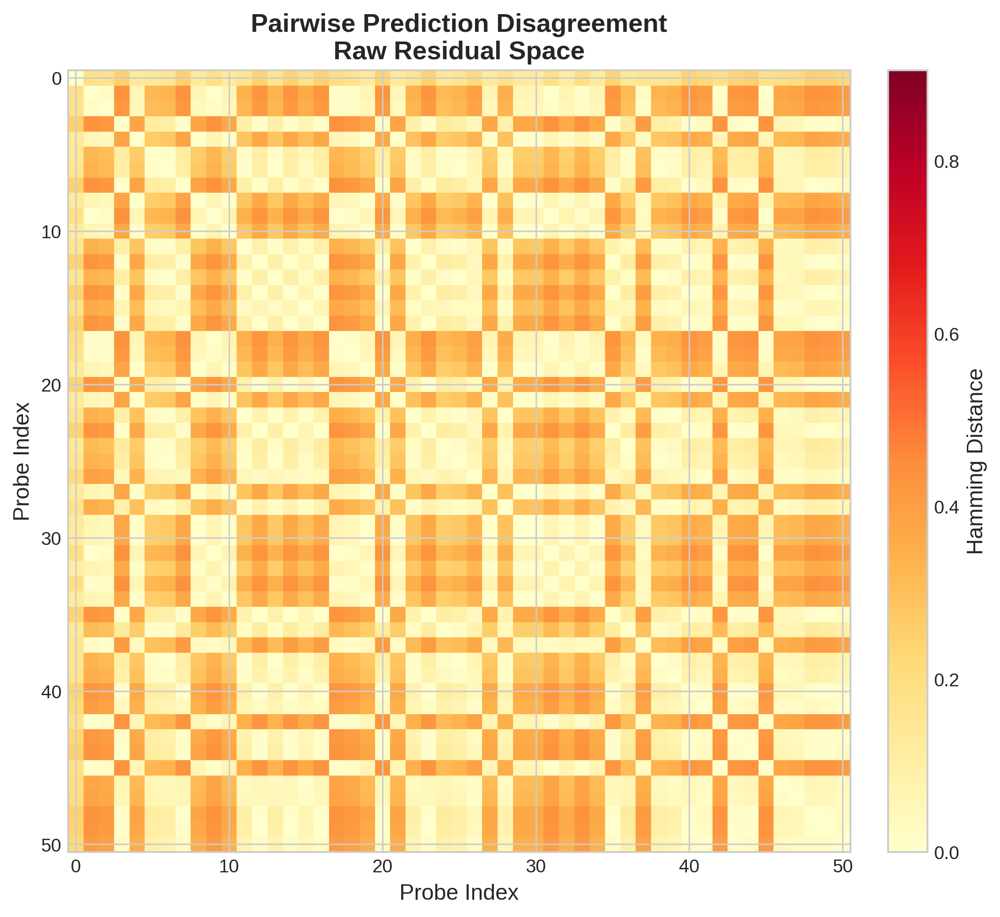
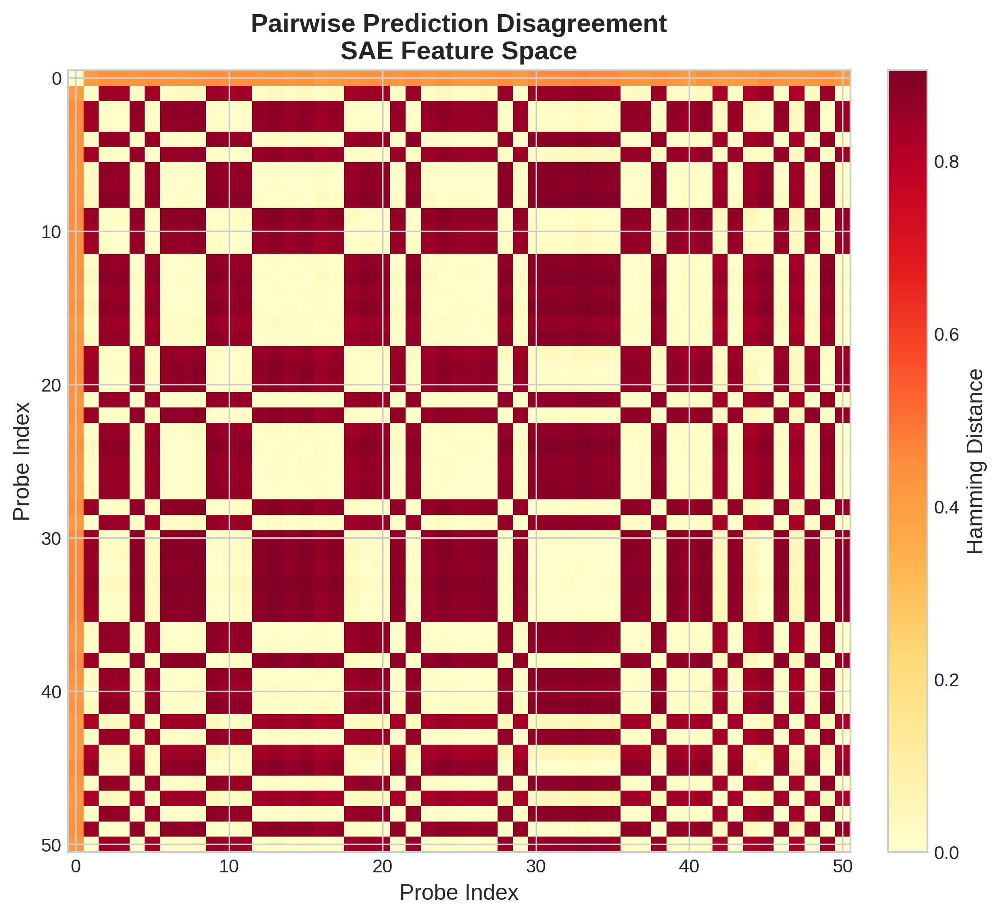
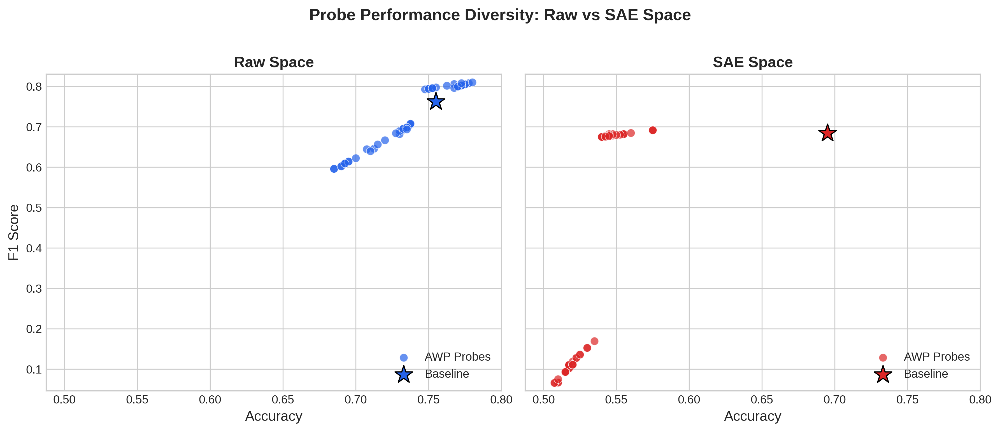
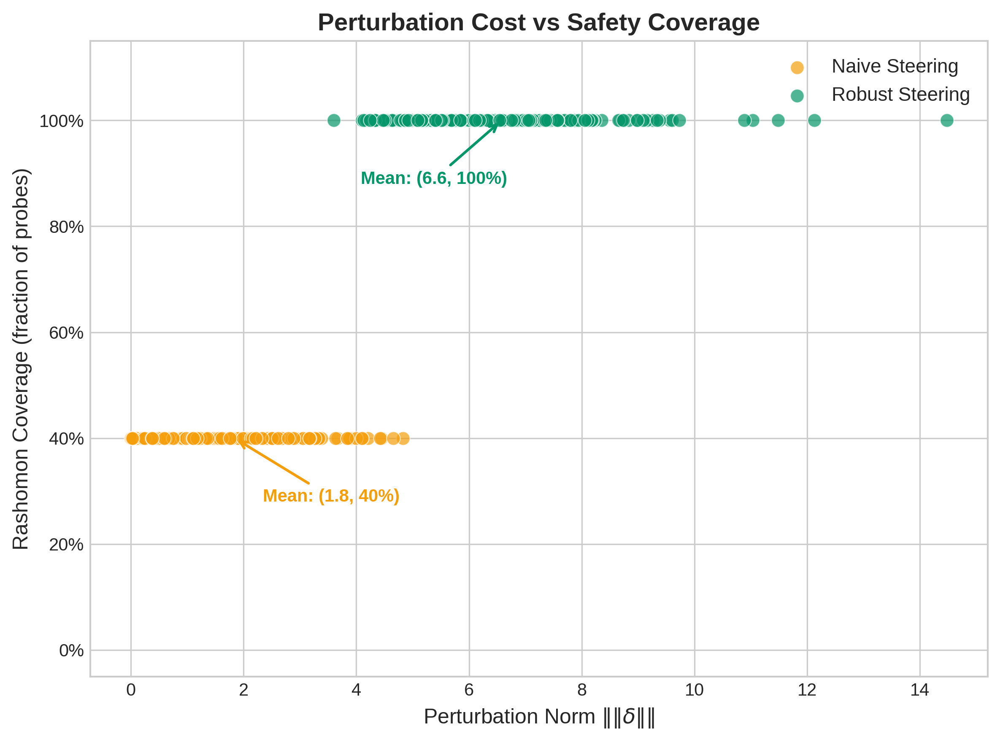

# Rashomon-Robust Representation Steering for LLM Safety

[](https://www.python.org/downloads/)
[](LICENSE)


**Linear safety probes used for representation steering are not unique.** Multiple probes fit the same data equally well yet disagree on up to 90% of test predictions &mdash; a phenomenon known as the *Rashomon effect*. Naive steering that targets only one probe leaves most of the Rashomon set unaddressed. We derive a closed-form robust steering perturbation (via the loss Hessian) that provably covers all near-optimal probes, achieving **100% Rashomon coverage** compared to naive steering's 40%.

## Key Findings

### 1. Probe Multiplicity Exists in Raw Residual Space

Using adversarial weight perturbation (AWP), we enumerate 50 linear probes within an &epsilon;-Rashomon set of the baseline safety probe on Gemma-2 2B layer-10 residuals. Despite near-identical loss, these probes disagree on **19.5% of test predictions** on average (max 43.8%).



### 2. SAE Projection Amplifies Multiplicity

Projecting activations through a Gemma Scope sparse autoencoder (16k features, JumpReLU) dramatically amplifies the Rashomon effect: mean pairwise disagreement rises to **44.5%** with maximum disagreement of **90.5%**. The higher-dimensional, sparser SAE space admits far more distinct decision boundaries at equivalent loss.




The SAE-space distribution is strikingly bimodal: probe pairs either agree almost perfectly or disagree on ~85% of examples, indicating two coherent but opposing decision strategies coexist within the Rashomon set.



### 3. Robust Steering Solves the Rashomon Problem

We derive a minimum-norm perturbation &delta; that satisfies the safety constraint for **all** probes in the Rashomon ellipsoid simultaneously (Eq. 3, closed-form via the loss Hessian). Robust steering achieves 100% Rashomon coverage on every test example, at a cost of ~3.25x larger perturbation norm.



## Method Overview

```
BeaverTails (safe/unsafe responses)
    --> Gemma-2 2B, Layer 10 residual stream (d=2304)
        --> Linear probe (BCE + L2)
            --> AWP: enumerate Rashomon set (50 probes, eps=0.15)
                --> Pairwise Hamming analysis (M1)
        --> Gemma Scope SAE (JumpReLU, 16k features)
            --> Same pipeline in SAE space (M2)
        --> Loss Hessian at baseline (d+1 x d+1)
            --> Robust delta via Hessian-scaled bisection (M3A)
                --> Coverage comparison: naive vs robust (M3A)
```

**Core equation (robust constraint):**

> &theta;<sup>T</sup> x<sub>new</sub> &minus; &radic;(2&epsilon; &middot; x<sub>new</sub><sup>T</sup> H<sup>&minus;1</sup> x<sub>new</sub>) &ge; t

where &theta; = [w; b] is the probe, H is the BCE Hessian, &epsilon; is the Rashomon radius, and t is the safety threshold.

## Results Summary

| Metric | Raw Space | SAE Space |
|--------|-----------|-----------|
| Input dimension | 2,304 | 16,384 |
| Baseline accuracy | 75.5% | 69.5% |
| Baseline AUROC | 85.7% | 72.2% |
| Mean Hamming distance | 19.5% | 44.5% |
| Max Hamming distance | 43.8% | 90.5% |
| Accuracy range | [68.5%, 78.0%] | [50.8%, 69.5%] |
| F1 range | [59.6%, 81.0%] | [6.6%, 69.2%] |

| Steering Method | Mean ||&delta;|| | Mean Coverage | 100% Coverage Rate |
|-----------------|-----------------|---------------|-------------------|
| Naive | 2.13 | 40.0% | 0.0% |
| Robust (Hessian) | 6.93 | 100.0% | 100.0% |

## Reproduction

### Environment Setup

```bash
conda create -n sae_steering python=3.10 -y
conda activate sae_steering
pip install -r requirements.txt
```

### Running the Pipeline

Execute scripts in order. Each script saves its outputs to `outputs/`.

```bash
# Step 1: Train baseline probe on BeaverTails activations
python scripts/train_baseline_probe.py

# Step 2: Enumerate Rashomon set via AWP (raw space)
python scripts/run_awp_rashomon.py

# Step 3: SAE projection + AWP (SAE space)
python scripts/run_sae_pipeline.py

# Step 4: Robust vs naive steering comparison
python scripts/run_robust_steering.py

# Step 5: Generate figures
python scripts/generate_figures.py
```

Steps 1-4 require GPU access and will download models from HuggingFace. Step 5 runs on CPU using saved CSVs and `.pt` files.

## Project Structure

```
robust-representation-steering/
├── README.md
├── LICENSE
├── .gitignore
├── requirements.txt
├── assets/
│   └── figures/               # Generated visualizations
├── src/
│   ├── __init__.py
│   ├── data_pipeline.py       # BeaverTails loading & activation extraction
│   ├── probe.py               # Linear probe (train + evaluate)
│   ├── awp.py                 # Adversarial weight perturbation
│   ├── hessian.py             # BCE Hessian computation
│   ├── steering.py            # Naive & robust delta solvers
│   └── sae_utils.py           # Gemma Scope SAE (JumpReLU) utilities
├── scripts/
│   ├── train_baseline_probe.py
│   ├── run_awp_rashomon.py
│   ├── run_sae_pipeline.py
│   ├── run_robust_steering.py
│   └── generate_figures.py
├── configs/
├── notebooks/
└── outputs/                   # Experiment artifacts (large .pt files gitignored)
```

## Citation

```bibtex
@software{meng2026rashomon,
  title   = {Rashomon-Robust Representation Steering for LLM Safety},
  author  = {Meng, Zihua},
  year    = {2026},
  url     = {https://github.com/ZihuaMeng/robust-representation-steering}
}

@article{team2024gemma,
  title   = {Gemma 2: Improving Open Language Models at a Practical Size},
  author  = {Gemma Team, Google DeepMind},
  year    = {2024},
  journal = {arXiv preprint arXiv:2408.00118}
}

@article{lieberum2024gemma,
  title   = {Gemma Scope: Open Sparse Autoencoders Everywhere All At Once on Gemma 2},
  author  = {Lieberum, Tom and Rajamanoharan, Senthooran and Conmy, Arthur and others},
  year    = {2024},
  journal = {arXiv preprint arXiv:2408.05147}
}

@inproceedings{ji2024beavertails,
  title     = {BeaverTails: Towards Improved Safety Alignment of LLM via a Human-Preference Dataset},
  author    = {Ji, Jiaming and Liu, Mickel and Dai, Josef and others},
  booktitle = {NeurIPS},
  year      = {2024}
}

@inproceedings{wu2020adversarial,
  title     = {Adversarial Weight Perturbation Helps Robust Generalization},
  author    = {Wu, Dongxian and Xia, Shu-Tao and Wang, Yisen},
  booktitle = {NeurIPS},
  year      = {2020}
}
```

## License

This project is licensed under the MIT License. See [LICENSE](LICENSE) for details.
